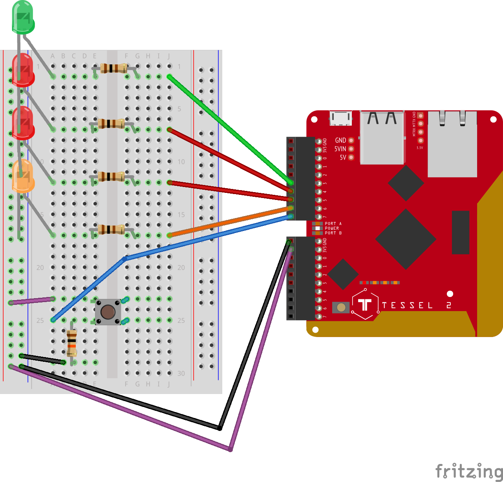

# twitch-tessel
Some hacking on the Tessel while streaming on Twitch

# What it does

1. It will start up a webserver exposing two endpoints:
    - `/` serves the `index.html` file content
    - `/incoming` which will toggle the orange LED connected. Can be used to connect [Twilio](https://www.twilio.com/docs/api/twiml/sms/twilio_request) for toggling via SMS.
2. Expose an outside available URL using [localtunnel.me](http://localtunnel.me).
3. Allows toggling the LEDs on the board using the page served on the `/` route using websockets.
4. Shows the status of the button connected to the Tessel on the webpage using websockets.

# Setup

## What you need
Either the [Johnny-Five Inventors Kit](https://www.sparkfun.com/j5ik) or:
- [Tessel](http://tessel.io)
- 1 Breadboard
- 4 LEDs
- 4x 100Ω Resistors
- 1x 10kΩ Resistor
- 1x Momentary Push Button
- Wires

## Wiring

Follow the following wiring:



You can find the Fritzing file [here](breadboard-wiring.fzz)

## Code

### 1. Download code and install dependencies

```bash
git clone https://github.com/dkundel/twitch-tessel
cd twitch-tessel
npm install
```

### 2. Make sure your Tessel is setup and connected using the Tessel CLI. [Instructions here](https://tessel.io/start)

### 3. Run code

```bash
t2 run index.js
```

# License

MIT

# Contributors

Dominik Kundel